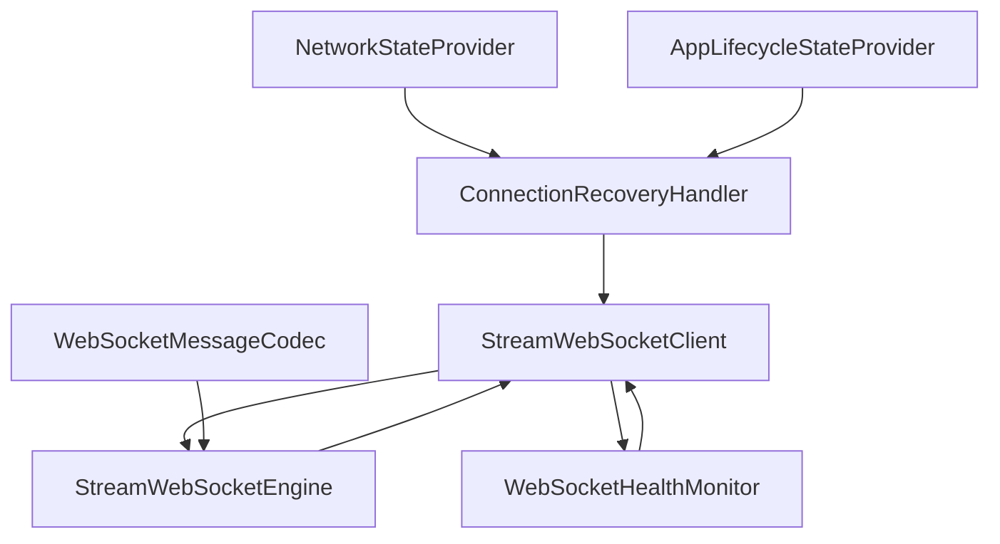

# Stream Core WebSocket

Stream Core WebSocket provides a robust WebSocket client with automatic reconnection, health monitoring, and type-safe event handling for real-time applications.

The WebSocket implementation includes comprehensive connection lifecycle management, intelligent reconnection policies, and structured event processing for building reliable real-time features.

## Architecture Overview

The WebSocket system consists of several key components working together:

- **[StreamWebSocketEngine]**: Handles low-level WebSocket connections and message transport
- **[StreamWebSocketClient]**: Main public interface for WebSocket operations and state management  
- **[WebSocketHealthMonitor]**: Manages ping/pong health checks to detect connection issues
- **[ConnectionRecoveryHandler]**: Implements intelligent reconnection with configurable policies



## WebSocketMessageCodec

An interface for WebSocket message encoding and decoding.

Handles the serialization and deserialization of messages between WebSocket transport format and application-specific types. The codec supports both text and binary message formats.

```dart
abstract interface class WebSocketMessageCodec<Incoming, Outgoing> {
  /// Encodes an outgoing message for WebSocket transmission.
  ///
  /// Returns either a [String] or [Uint8List] for transmission over the WebSocket connection.
  Object encode(Outgoing message);

  /// Decodes an incoming WebSocket message.
  ///
  /// The [message] received from the WebSocket is converted to the application-specific incoming message type.
  Incoming decode(Object message);
}
```

### Implementation Example

```dart
class JsonMessageCodec implements WebSocketMessageCodec<WsEvent, WsRequest> {
  @override
  String encode(WsRequest message) {
    return jsonEncode(message.toJson());
  }

  @override
  WsEvent decode(Object message) {
    final json = jsonDecode(message as String);
    return WsEvent.fromJson(json);
  }
}
```

## StreamWebSocketClient

A WebSocket client with connection management and event handling.

The primary interface for WebSocket connections in the Stream Core SDK that provides functionality for real-time communication with automatic reconnection, health monitoring, and sophisticated state management.

Each [StreamWebSocketClient] instance manages its own connection lifecycle and maintains state that can be observed for real-time updates.

### Constructor

Creates a [StreamWebSocketClient] instance for real-time WebSocket communication.

```dart
StreamWebSocketClient({
  required WebSocketOptions options,
  required WebSocketMessageCodec<WsEvent, WsRequest> messageCodec,
  PingRequestBuilder pingRequestBuilder = _defaultPingRequestBuilder,
  void Function()? onConnectionEstablished,
  Iterable<EventResolver<WsEvent>>? eventResolvers,
})
```

The [options] specify connection configuration including URL, protocols, and query parameters. The [messageCodec] handles encoding outgoing requests and decoding incoming events. When [onConnectionEstablished] is provided, it's called when the connection is ready for authentication.

### Authentication

When authentication is required, send authentication messages in the [onConnectionEstablished] callback:

```dart
final client = StreamWebSocketClient(
  options: WebSocketOptions(url: 'wss://api.example.com'),
  messageCodec: MyMessageCodec(),
  onConnectionEstablished: () {
    client.send(AuthRequest(token: authToken));
  },
);
```

## WebSocketHealthMonitor

A health monitor for WebSocket connections with ping/pong management.

Manages the health checking mechanism for WebSocket connections by automatically sending ping requests and monitoring for pong responses to detect unhealthy connections.

The monitor integrates with [StreamWebSocketClient] to provide automatic connection health detection and recovery triggers.

### Health Check Process

The health monitor follows a structured process:

1. **Automatic Start**: Monitoring begins when connection state becomes [Connected]
2. **Ping Scheduling**: Sends periodic ping requests every 25 seconds by default
3. **Pong Monitoring**: Starts timeout timer after each ping request  
4. **Unhealthy Detection**: Marks connection unhealthy if no pong received within 3 seconds by default
5. **Automatic Stop**: Stops monitoring when connection becomes inactive

### Custom Ping Messages

The default ping request includes the connection ID. For custom ping messages, provide a [pingRequestBuilder] to [StreamWebSocketClient]:

```dart
StreamWebSocketClient(
  pingRequestBuilder: (healthCheckInfo) {
    return CustomPingRequest(
      connectionId: healthCheckInfo?.connectionId,
      timestamp: DateTime.now(),
    );
  },
  // ... other parameters
);
```

## ConnectionRecoveryHandler

A connection recovery handler with intelligent reconnection management.

Provides intelligent reconnection management with multiple policies and retry strategies for [StreamWebSocketClient] instances. Automatically handles reconnection based on various conditions like network state, app lifecycle, and connection errors.

The handler monitors connection state changes and applies configurable policies to determine when reconnection should occur.

### Basic Setup

```dart
final client = StreamWebSocketClient(...);
final recoveryHandler = ConnectionRecoveryHandler(client: client);
```

### Advanced Setup

For mobile apps, include network and app lifecycle monitoring:

```dart
final recoveryHandler = ConnectionRecoveryHandler(
  client: client,
  networkStateProvider: NetworkStateProvider(),
  appLifecycleStateProvider: AppLifecycleStateProvider(),
);
```

### Reconnection Rules

Automatic reconnection is **enabled** for:
- Server-initiated disconnections (except authentication/client errors)
- System-initiated disconnections (network changes, etc.)
- Unhealthy connections (missing pong responses)

Automatic reconnection is **disabled** for:
- User-initiated disconnections
- Server errors with code 1000 (normal closure)
- Token invalid/expired errors
- Client errors (4xx status codes)

## Event Resolvers

Functions that transform or filter incoming events before emission.

Event resolvers allow preprocessing of incoming [WsEvent] instances before they're emitted to listeners. Resolvers can transform events, filter them, or provide fallback handling.

Multiple resolvers are evaluated in order until one returns a non-null result.

```dart
WsEvent? myEventResolver(WsEvent event) {
  if (event is RawMessageEvent) {
    return MyCustomEvent.fromRaw(event);
  }
  return null; // Let other resolvers handle it
}

final client = StreamWebSocketClient(
  eventResolvers: [myEventResolver],
  // ... other parameters
);
```

## Connection States

The connection state management system for WebSocket lifecycle.

The [StreamWebSocketClient] maintains several connection states that represent the current status of the WebSocket connection:

- **[Initialized]**: Initial state, no connection attempt made
- **[Connecting]**: Attempting to establish WebSocket connection
- **[Authenticating]**: Connection established, authentication in progress  
- **[Connected]**: Fully connected and authenticated
- **[Disconnecting]**: Connection is being closed
- **[Disconnected]**: Connection closed

### Monitoring Connection State

```dart
client.connectionState.on((state) {
  switch (state) {
    case Connected():
      print('Connected to WebSocket');
    case Disconnected():
      print('Disconnected from WebSocket');
    // ... handle other states
  }
});
```

## Usage

### Sending Messages

Sends a message through the WebSocket connection.

```dart
final result = client.send(MyRequest(data: 'hello'));
if (result.isFailure) {
  print('Failed to send message: ${result.error}');
}
```

### Listening to Events

The client provides type-safe event handling through the [events] emitter:

```dart
// Listen to specific event types
client.events.on<MyEvent>((event) {
  print('Received: ${event.data}');
});

// Listen to all events
client.events.on<WsEvent>((event) {
  print('Received event: $event');
});
```

## Complete Example

A comprehensive example demonstrating WebSocket client setup with all components:

```dart
// 1. Create message codec
final messageCodec = JsonMessageCodec();

// 2. Create WebSocket client
final client = StreamWebSocketClient(
  options: WebSocketOptions(
    url: 'wss://api.example.com/ws',
    queryParameters: {'token': authToken},
  ),
  messageCodec: messageCodec,
  onConnectionEstablished: () {
    client.send(AuthRequest(token: authToken));
  },
);

// 3. Set up connection recovery
final recoveryHandler = ConnectionRecoveryHandler(
  client: client,
  networkStateProvider: NetworkStateProvider(),
  appLifecycleStateProvider: AppLifecycleStateProvider(),
);

// 4. Listen to events
client.events.on<MessageEvent>((event) {
  print('Received message: ${event.content}');
});

// 5. Monitor connection state
client.connectionState.on((state) {
  switch (state) {
    case Connected():
      print('WebSocket connected');
    case Disconnected():
      print('WebSocket disconnected');
  }
});

// 6. Connect
await client.connect();

// 7. Send messages
final result = client.send(ChatMessage(content: 'Hello, World!'));
if (result.isFailure) {
  print('Send failed: ${result.error}');
}

// 8. Clean up when done
await client.disconnect();
await recoveryHandler.dispose();
```

