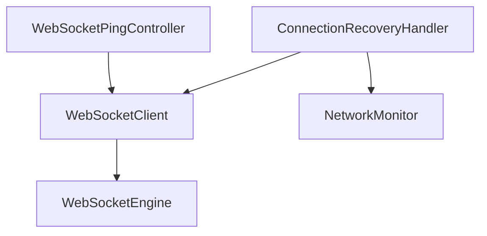

# Stream Core Websocket

## TODO
- [ ] cover with unit tests
- [ ] test implementation
- [ ] reconnect logic
- [ ] improve docs
- [ ] replace print statements with proper logs

## Overall architecture

The `WebSocketEngine` is purely responsible for connecting to the websocket and handling events.

The `WebSocketClient` is the public interface and can be used for apps to connect to a websocket.

The `WebSocketPingController` keeps track of the timings of the ping/pong for health checks. 
It uses the `WebSocketPingClient`, implemented by the `WebSocketClient` to send the ping and listen to pongs. 
It also will call the `WebSocketPingClient` if it should disconnect because of a bad connection.

The `ConnectionRecoveryHandler` manages the reconnection for all cases. 




## WebSocketClient
```dart
  WebSocketClient({
    required String url,
    required this.eventDecoder,
    this.pingReguestBuilder,
    this.onConnectionEstablished,
    this.onConnected,
  }) 
```
The `WebSocketClient` always requires an `eventDecoder`. You should use this to map the websocket message to your own event.
It's important to also map to the `HealthCheckPongEvent` for health check events.


When you need to authenticate for the websocket you should sent the authentication event in `onConnectionEstablished`.
The `onConnected` is called when the connection is fully established after (optional) authentication.

## WebSocketPingController

The `WebSocketPingController` will use the `WebSocketClient` to send pings to the backend while the websocket is connected. By default it sends a ping every 25 seconds. It expects a pong from the backend within a certain interval, by default 3 seconds. If it doesn't get the pong it will request the `WebSocketClient` to disconnect using `disconnectNoPongReceived`.

By default the `WebSocketClient` will send a basic health check event for the ping with the connectionId. If you need a different health check event, for example for the SFU, you need to add a `pingReguestBuilder` in the `WebSocketClient`.

## ConnectionRecoveryHandler

The `ConnectionRecoveryHandler` manages the reconnection for all cases. Currently implemented are network related reconnection events 
and reconnections for websocket errors. The reason in the disconnected state determines if the recovery will reconnect or not.

When creating a `WebSocketClient` you should also create a  `ConnectionRecoveryHandler` yourself like this:

```dart
final client = WebSocketClient(...);
final recoveryHandler = ConnectionRecoveryHandler(client: client);
```

The `WebSocketClient` itself just disconnects when there is an error and the `ConnectionRecoveryHandler` is responsible for reconnecting when needed.